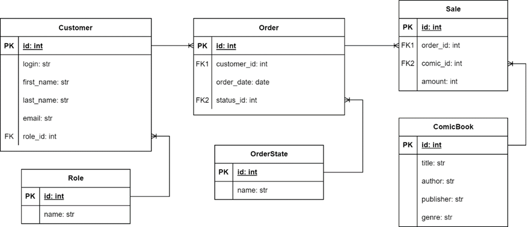

# Cosmics - Интернет-магазин комиксов и связанных товаров

## Описание

"**Cosmics**" – это интернет-магазин специализированный на продаже комиксов и связанных товаров. 

Наша цель - создать удобную и привлекательную платформу для всех любителей комиксов.

## Роли пользователей

1. **Клиент**: Пользователь, который просматривает, выбирает и приобретает комиксы.
2. **Администратор**: Управляет ассортиментом товаров, обрабатывает заказы и осуществляет аналитику продаж.

## Бизнес-цели

- Создание удобной и привлекательной платформы для покупки комиксов.
- Повышение продаж и увеличение клиентской базы.

## Сценарии использования системы

1. **Регистрация в системе (Клиент)**:
   - Пользователь заполняет необходимые данные для регистрации.
   
2. **Покупка комикса (Клиент)**:
   - Пользователь выбирает интересующий комикс из каталога.
   - Добавляет комикс в корзину.
   - Оформляет заказ, выбирает способ оплаты и адрес доставки.
   
3. **Просмотр своей истории заказов (Клиент)**:
   - Пользователь просматривает свои предыдущие заказы.
   
4. **Просмотр и изменение заказов клиентов (Администратор)**:
   - Администратор просматривает и, при необходимости, редактирует заказы клиентов.
   
5. **Маркетинговое исследование (Администратор)**:
   - Создание информативного отчёта по продажам на основе заданных параметров.
   - Возможность сохранить сформированный отчёт.

## Моделируем ERD

## Выбор сервера приложений и СУБД

- **Сервер приложений**: FastAPI-Uvicorn
- **СУБД**: Sqlite3

## Список используемых технологий

- **FastAPI-Uvicorn**: Сервер приложений, обеспечивает быструю разработку и эффективную обработку запросов.
- **Sqlite3**: Легковесная и встроенная база данных, проста в использовании и обладает высокой производительностью.
- **Python**: Язык для написания бэкенда, простота и читаемость кода.
- **HTML, CSS, JS**: Языки для написания фронтенда, обеспечивают создание интерфейса и взаимодействие с пользователем.
- **SQLAlchemy**: Библиотека для работы с базами данных в Python, обеспечивает удобство и безопасность взаимодействия с СУБД.
- **JWT** (возможно будем использовать): Стандарт для безопасной передачи информации в виде токена через сеть для аутентификации и авторизации.

## Архитектура приложения

- **Компоненты**:
  - Frontend (React)
  - Backend (FastAPI)
  - База данных (Sqlite3)
- **Связи**:
  - Frontend взаимодействует с Backend через API.
  - Backend обращается к базе данных для получения/записи данных.
- Логика приложения управляется в основном на стороне Backend, что обеспечивает масштабируемость, безопасность и удобство использования для пользователей интернет-магазина комиксов.